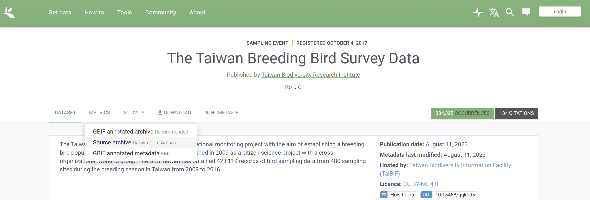
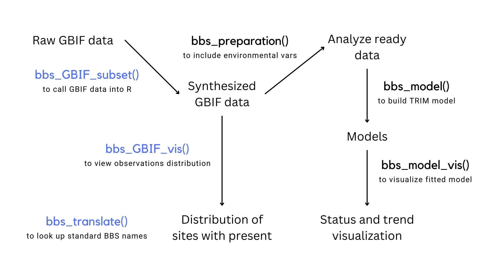

<!-- README.md is generated from README.Rmd. Please edit that file -->

```{r, include = FALSE}
knitr::opts_chunk$set(
  collapse = TRUE,
  comment = "#>",
  fig.path = "man/figures/README-",
  out.width = "100%"
)
```

# bbsTaiwan

<!-- badges: start -->

[](https://github.com/SunnyTseng/bbsTaiwan/actions/workflows/R-CMD-check.yaml)

<!-- badges: end -->

The goal of bbsTaiwan is to streamline Taiwan Breeding Birds Survey (BBS) data retrieval and analysis. It will support data retrieval from GBIF, where Taiwan BBS data are stored. ‘bbsTrim’ will also include the population trend modelling, using TRIM (TRends and Indices for Monitoring data). Users can tailor species analysis, controlling data stratification, preparation, and modeling. The goal is to expand Taiwan BBS data access to the broader R-society in Taiwan.

## Set up

1.  Package installation: you can install the development version of bbsTaiwan from [GitHub](https://github.com/) with:

``` r
# install.packages("devtools")
devtools::install_github("SunnyTseng/bbsTaiwan")
```

2.  Data download: you can retrieve Taiwan Breeding Birds Survey data from this [GBIF dataset](https://www.gbif.org/zh-tw/dataset/f170f056-3f8a-4ef3-ac9f-4503cc854ce0). After visiting the site, use **Download** \> **Source archive** option while downloading.



## Workflow



## How to use

This is a basic example which shows you how to use the package:

```{r example, eval=FALSE}
library(bbsTaiwan)

# looked up the species of interest 
bbs_translate("山紅頭")
bbs_translate("金翼白眉")

# subset the GBIF data to the species of interest
bird_data <- bbs_subset(folder = "PATH_TO_GBIF_FOLDER",
                        from = 2009,
                        to = 2015,
                        species_list = c())

# visualize the species distribution 
bird_map <- bbs_visualization(data = bird_data)
```
