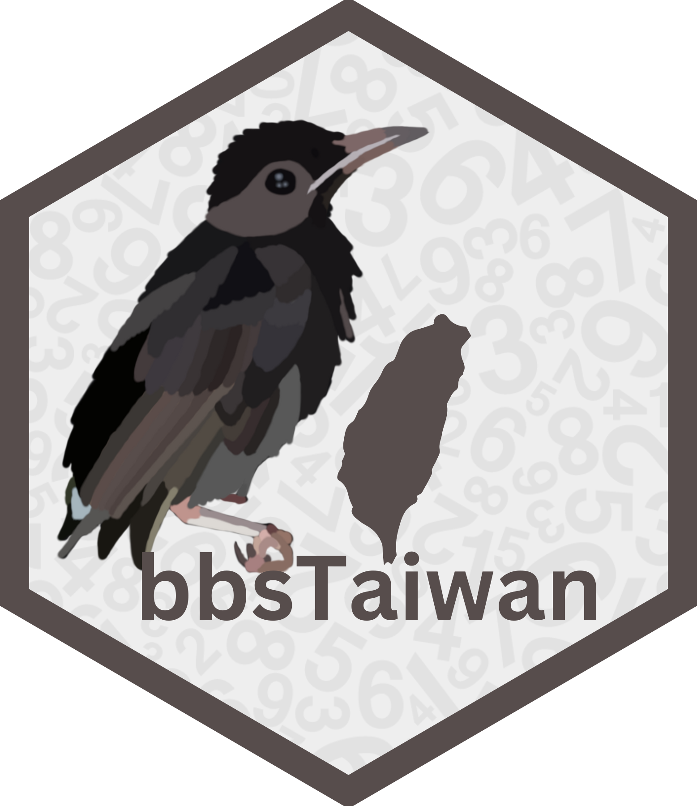

<!-- README.md is generated from README.Rmd. Please edit that file -->

```{r, include = FALSE}
knitr::opts_chunk$set(
  collapse = TRUE,
  comment = "#>",
  fig.path = "man/figures/README-",
  out.width = "100%",
  eval = TRUE
)

library(bbsTaiwan)
```

# bbsTaiwan <a href="https://sunnytseng.github.io/bbsTaiwan/"></a>

<!-- badges: start -->

[](https://codecov.io/github/SunnyTseng/bbsTaiwan) [](https://lifecycle.r-lib.org/articles/stages.html#stable) [](https://mybinder.org/v2/gh/SunnyTseng/bbsTaiwan/master?urlpath=rstudio)

<!-- badges: end -->

## Overview 簡介 📑

The goal of `bbsTaiwan` is to streamline the retrieval and analysis of Taiwan Breeding Bird Survey (BBS) data. This package facilitates data access from GBIF, where Taiwan BBS data are stored. While the data is openly available on GBIF, its complex arrangement in the Darwin Core format can make it challenging to understand and use, often requiring advanced data wrangling skills. The `bbsTaiwan` package is designed to simplify this process, making it easier to access and utilize Taiwan BBS data.

`bbsTaiwan` package 的目的是簡化臺灣繁殖鳥類大調查（BBS）資料的檢索和分析。該 package 可以即時取得存放在 GBIF 平台上的 BBS 資料，`bbsTaiwan` package 旨在簡化 BBS 的取得以及基本的分析、資料視覺化，讓使用者能更容易地檢索和利用臺灣 BBS 資料。

This project was supported by the [rOpenSci Champions Program](https://ropensci.org/champions/) 2023-2024, with [Sunny Tseng](https://sunnytseng.ca/) as the main developer and [Eunseop Kim](https://ropensci.org/blog/2023/11/29/champions-program-mentors-2023/) as the mentor. [Jerome Ko](https://scholar.google.com/citations?user=XbUxScIAAAAJ&hl=zh-TW) kindly assisted in interpreting and accessing the Taiwan BBS data.

此計畫由 [rOpenSci Champions Program](https://ropensci.org/champions/) 2023-2024 資助，主要開發者為 [Sunny Tseng](https://sunnytseng.ca/)，[Eunseop Kim](https://ropensci.org/blog/2023/11/29/champions-program-mentors-2023/) 協助開發，而 [Jerome Ko](https://scholar.google.com/citations?user=XbUxScIAAAAJ&hl=zh-TW) 則代表 Taiwan BBS 官方，協助資料的取得及詮釋。

## Version 版本 🔖

**v1.0.0 (Initial Release):** Developed based on the GBIF Taiwan BBS dataset v1.9, which covers data from 2009 to 2016.

v1.0.0（初始版本）：基於 GBIF 臺灣 BBS 資料集 v1.9 開發，包含 2009 年至 2016 年的資料。

## Installation 安裝 💻

You can install and load the development version of `bbsTaiwan` from Github with:

在 R 輸入以下指令，可從 Github 安裝 bbsTaiwan 的開發版本：

```{r eval = FALSE}
# install.packages("devtools")
devtools::install_github("SunnyTseng/bbsTaiwan")
```

## Main functions 主要功能 ⛺

`bbsTaiwan` provides several intuitive imported datasets and data processing functions. To perform basic data retrieval and visualization:

`bbsTaiwan` 提供了幾個直觀的資料處理功能：

-   `bbs_history()` examine the number of BBS sites surveyed each year; 顯示每年調查的 BBS 站點數量

-   `bbs_sites()` return the coordinates of all BBS sites; 顯示所有 BBS 樣點坐標

-   `bbs_fetch()` fetch the cleaned version of Taiwan BBS cccurrence data by species; 取得經過清理的物種出現資料

-   `bbs_plotmap()` visualize species distribution across all BBS sites; 視覺化物種分佈

-   `bbs_translate()` translate bird species’ Chinese common name to scientific name; 將鳥類的中文俗名翻譯為學名

For accessing the raw Taiwan BBS dataset on GBIF:

直接取得在 GBIF 上的臺灣 BBS 資料集：

-   `occurrence`: times and locations at which particular species have been recorded; 特定物種的出現時間和地點

-   `event`: the protocols used, the sample size, and the location for each; 使用的調查方法、樣本數量以及各站點位置

-   `measurementorfacts`: additional information relating to the events; 與事件相關的附加信息

-   `extendedmeasurementorfact`: additional information relating to the taxon occurrences; 與物種出現相關的附加信息

## Usage 使用方法 💡

-   [Get started](https://sunnytseng.github.io/bbsTaiwan/articles/bbsTaiwan.html) 基本操作範例

```{r example}
library(bbsTaiwan)

## Get data for species of interest
bbs_fetch(c("白頭翁", "烏頭翁"))

## Find the distribution/overlap of two species
bbs_plotmap(c("白頭翁", "烏頭翁"))
```
