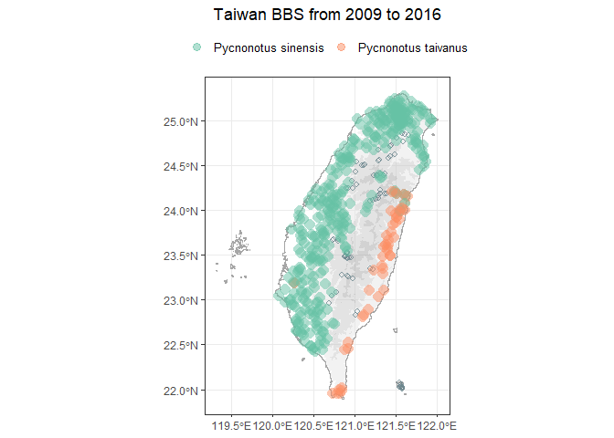

<!-- README.md is generated from README.Rmd. Please edit that file -->

# bbsTaiwan <a href="https://sunnytseng.github.io/bbsTaiwan/"></a>

<!-- badges: start -->

[](https://lifecycle.r-lib.org/articles/stages.html#experimental)

<!-- badges: end -->

## Overview 📑

The goal of `bbsTaiwan` is to streamline the retrieval and analysis of
Taiwan Breeding Bird Survey (BBS) data. This package facilitates data
access from GBIF, where Taiwan BBS data are stored. While the data is
openly available on GBIF, its complex arrangement in the Darwin Core
format can make it challenging to understand and use, often requiring
advanced data wrangling skills. The `bbsTaiwan` package is designed to
simplify this process, making it easier to access and utilize Taiwan BBS
data.

This project was supported by the [rOpenSci Champions
Program](https://ropensci.org/champions/) 2023-2024, with [Sunny
Tseng](https://sunnytseng.ca/) as the main developer and [Eunseop
Kim](https://ropensci.org/blog/2023/11/29/champions-program-mentors-2023/)
as the mentor.

- [Get
  started](https://sunnytseng.github.io/bbsTaiwan/articles/bbsTaiwan.html)

- Black Bulbul case study

## Version 🔖

**`bbsTaiwan` v1.0.0 (Initial Release):** Developed based on the GBIF
Taiwan BBS dataset v1.9, which covers data from 2009 to 2016.

## Installation 💻

You can install and load the development version of `bbsTaiwan` from
Github with:

``` r
# install.packages("devtools")
devtools::install_github("SunnyTseng/bbsTaiwan")
```

## Main functions ⛺

`bbsTaiwan` provides several intuitive imported datasets and data
processing functions. To perform basic data retrieval and visualization:

- `bbs_translate()` translate bird species’ Chinese common name to
  scientific name

- `bbs_fetch()` fetch the cleaned version of Taiwan BBS cccurrence data
  by species

- `bbs_plotmap()` visualize species distribution across all BBS sites

- `bbs_history()` examine the number of BBS sites surveyed each year

- `bbs_sites()` return the coordinates of sll BBS sites

For accessing the raw Taiwan BBS dataset on GBIF:

- `occurrence`: times and locations at which particular species have
  been recorded

- `event`: the protocols used, the sample size, and the location for
  each

- `measurementorfacts`: additional information relating to the events

- `extendedmeasurementorfact`: additional information relating to the
  taxon occurrences

## Usage 💡

``` r
library(bbsTaiwan)

## Get data for species of interest
bbs_fetch(c("白頭翁", "烏頭翁"))
#> # A tibble: 92,475 × 16
#>     year month   day site   locationID decimalLatitude decimalLongitude weather
#>    <dbl> <dbl> <dbl> <chr>  <chr>                <dbl>            <dbl> <chr>  
#>  1  2009     3    10 A02-01 A02-01_01             25.1             122. <NA>   
#>  2  2009     3    10 A02-01 A02-01_01             25.1             122. <NA>   
#>  3  2009     4     5 A02-01 A02-01_01             25.1             122. <NA>   
#>  4  2009     4    26 A02-01 A02-01_01             25.1             122. <NA>   
#>  5  2009     3    10 A02-01 A02-01_01             25.1             122. <NA>   
#>  6  2009     4    26 A02-01 A02-01_01             25.1             122. <NA>   
#>  7  2009     4     5 A02-01 A02-01_01             25.1             122. <NA>   
#>  8  2009     4    26 A02-01 A02-01_02             25.1             122. <NA>   
#>  9  2009     3    10 A02-01 A02-01_02             25.1             122. <NA>   
#> 10  2009     4     5 A02-01 A02-01_02             25.1             122. <NA>   
#> # ℹ 92,465 more rows
#> # ℹ 8 more variables: wind <chr>, habitat <chr>, scientificName <chr>,
#> #   vernacularName <chr>, individualCount <dbl>, time_slot <chr>,
#> #   distance <chr>, flock <chr>

## Find the distribution/overlap of two species
bbs_plotmap(c("白頭翁", "烏頭翁"))
```


