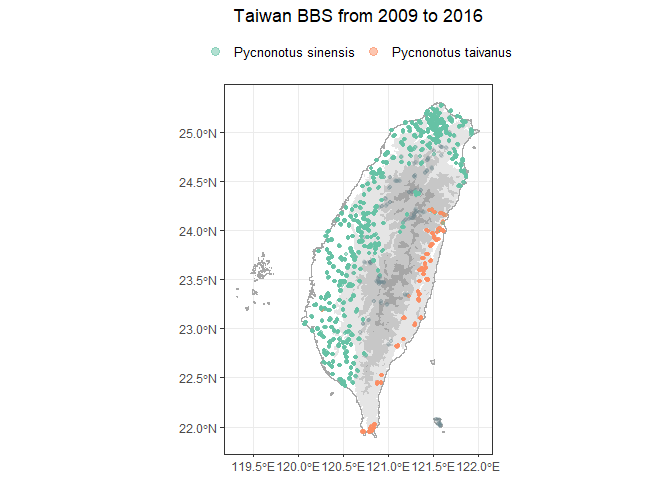

<!-- README.md is generated from README.Rmd. Please edit that file -->

# bbsTaiwan

<!-- badges: start -->

[](https://github.com/SunnyTseng/bbsTaiwan/actions/workflows/R-CMD-check.yaml)

<!-- badges: end -->

The goal of bbsTaiwan is to streamline Taiwan Breeding Birds Survey
(BBS) data retrieval and analysis. It will support data retrieval from
GBIF, where Taiwan BBS data are stored. ‘bbsTrim’ will also include the
population trend modelling. Users can tailor species analysis,
controlling data stratification, preparation, and modeling. The goal is
to expand Taiwan BBS data access to the broader R-society in Taiwan.

## 📑 Background

## 💻 Set up

You can install and load the development version of bbsTaiwan from
[GitHub](https://github.com/) with:

``` r
# install.packages("devtools")
devtools::install_github("SunnyTseng/bbsTaiwan")

# load the package
library(bbsTaiwan)
```

## ⛺ How to use

### If you need raw Taiwan BBS dataset on GBIF:

Taiwan BBS raw data can be accessed directly by typing the object name:

``` r
bbsTaiwan::occurrence
bbsTaiwan::event
bbsTaiwan::measurementorfacts
bbsTaiwan::extendedmeasurementorfact
```

The complete Taiwan BBS dataset on GBIF is following the Darwin Core
Archive (DwC - A) format:

- Occurrence: lists a set of times and locations at which particular
  species have been recorded

- Event: lists includes the protocols used, the sample size, and the
  location for each

- Measurement or Facts: includes additional information relating to the
  events

- Extended Measurement or Fact: includes additional information relating
  to the taxon occurrences

### `bbsTaiwan` also provide a workflow to process Taiwan BBS data:

This is a basic example which shows you how to use the package:

1.  Check out the distribution of the BBS sites and the number of sites
    that have been surveyed throughout the years:

``` r
bbs_history()
```


    #> NULL

1.  Look up the scientific name for species of interest

``` r
bbs_translate(c("白頭翁", "烏頭翁", "台灣噪眉"))
#> [1] "Pycnonotus sinensis"          "Pycnonotus taivanus"         
#> [3] "Trochalopteron morrisonianum"
```

2.  Fetch the data for the species of interest. If you need the dataset
    across all species, leave the argument `target_species` as `NULL`.

``` r
x <- bbs_fetch(target_species = bbs_translate("火冠戴菊鳥"))
#> Joining with `by = join_by(locationID)`
```

The output from `bbs_fetch` is a list with two elements: `occurrence`
and `site_info`. `occurrence` is a tibble, showing all the observations
for the target species within selected year range

``` r
x$occurrence
#> # A tibble: 3,109 × 15
#>     year month   day locationID eventID       weather wind  habitat occurrenceID
#>    <dbl> <dbl> <dbl> <chr>      <chr>         <chr>   <chr> <chr>   <chr>       
#>  1  2009     4    19 B14-01_10  TWBBS_2009_B… <NA>    <NA>  A3:B4:… TWBBS_2009_…
#>  2  2009     6     7 B13-01_06  TWBBS_2009_B… <NA>    <NA>  A3:C5:… TWBBS_2009_…
#>  3  2009     6    25 B13-01_06  TWBBS_2009_B… <NA>    <NA>  A3:C5:… TWBBS_2009_…
#>  4  2009     5    26 B13-01_05  TWBBS_2009_B… <NA>    <NA>  A3:C5:… TWBBS_2009_…
#>  5  2009     6     7 B13-01_05  TWBBS_2009_B… <NA>    <NA>  A3:C5:… TWBBS_2009_…
#>  6  2009     5    26 B13-01_03  TWBBS_2009_B… <NA>    <NA>  A3:C5:… TWBBS_2009_…
#>  7  2009     6     7 B13-01_03  TWBBS_2009_B… <NA>    <NA>  A3:C5:… TWBBS_2009_…
#>  8  2009     6    25 B13-01_01  TWBBS_2009_B… <NA>    <NA>  A3:C5:… TWBBS_2009_…
#>  9  2009     6     7 B13-01_07  TWBBS_2009_B… <NA>    <NA>  A2:C5:… TWBBS_2009_…
#> 10  2009     5    29 B13-01_08  TWBBS_2009_B… <NA>    <NA>  A2:C5:… TWBBS_2009_…
#> # ℹ 3,099 more rows
#> # ℹ 6 more variables: scientificName <chr>, vernacularName <chr>,
#> #   individualCount <dbl>, time_slot <chr>, distance <chr>, flock <chr>
```

The second element `site_info` is a tibble including all the BBS sites:

``` r
x$site_info
#> # A tibble: 4,160 × 9
#>    site  plot  locationID locality decimalLatitude decimalLongitude  elev region
#>    <chr> <chr> <chr>      <chr>              <dbl>            <dbl> <dbl> <chr> 
#>  1 A02-… 01    A02-01_01  台北縣…             25.1             122.  109. North 
#>  2 A02-… 02    A02-01_02  台北縣…             25.1             122.  105. North 
#>  3 A02-… 03    A02-01_03  台北縣…             25.1             122.  105. North 
#>  4 A02-… 04    A02-01_04  台北縣…             25.1             122.  105. North 
#>  5 A02-… 05    A02-01_05  台北縣…             25.1             122.  105. North 
#>  6 A02-… 06    A02-01_06  台北縣…             25.1             122.  105. North 
#>  7 A02-… 07    A02-01_07  台北縣…             25.1             122.  105. North 
#>  8 A02-… 08    A02-01_08  台北縣…             25.1             122.  105. North 
#>  9 A02-… 09    A02-01_09  台北縣…             25.1             122.  154. North 
#> 10 A02-… 10    A02-01_10  台北縣…             25.1             122.  154. North 
#> # ℹ 4,150 more rows
#> # ℹ 1 more variable: zone <chr>
```

The function `bbs_fetch` can also take multiple species at the same
time:

``` r
x <- bbs_fetch(bbs_translate(c("烏頭翁", "白頭翁")))
#> Joining with `by = join_by(locationID)`
```

3.  View the distribution of all the occurrence for the target species
    within selected year range

``` r
bbs_plotmap(x)
```



4.  Get basic summary statistics for the fetched data

``` r
bbs_stat(x)
#> # A tibble: 2 × 7
#> # Groups:   vernacularName, scientificName [2]
#>   vernacularName scientificName       East Mountain  West North Total
#>   <chr>          <chr>               <dbl>    <dbl> <dbl> <dbl> <dbl>
#> 1 烏頭翁         Pycnonotus taivanus  0.92     0.03  0.02  0     0.11
#> 2 白頭翁         Pycnonotus sinensis  0.14     0.25  0.96  0.98  0.78
```
