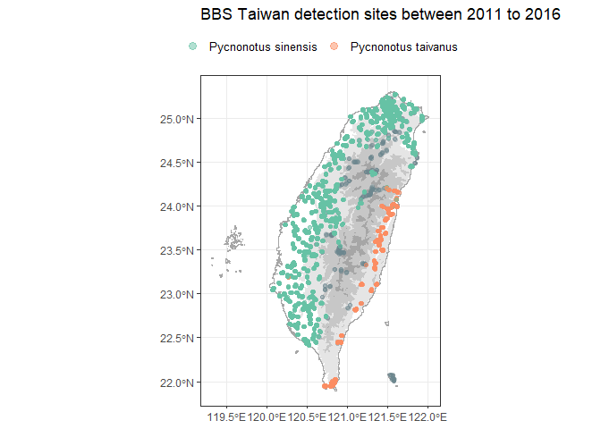

<!-- README.md is generated from README.Rmd. Please edit that file -->

# bbsTaiwan

<!-- badges: start -->

[](https://github.com/SunnyTseng/bbsTaiwan/actions/workflows/R-CMD-check.yaml)

<!-- badges: end -->

The goal of bbsTaiwan is to streamline Taiwan Breeding Birds Survey
(BBS) data retrieval and analysis. It will support data retrieval from
GBIF, where Taiwan BBS data are stored. ‘bbsTrim’ will also include the
population trend modelling. Users can tailor species analysis,
controlling data stratification, preparation, and modeling. The goal is
to expand Taiwan BBS data access to the broader R-society in Taiwan.

## Background

## Set up

Package installation and load: you can install the development version
of bbsTaiwan from [GitHub](https://github.com/) with:

``` r
# install.packages("devtools")
devtools::install_github("SunnyTseng/bbsTaiwan")

# load the package
library(bbsTaiwan)
```

## How to use

### If you need raw Taiwan BBS dataset on GBIF:

Taiwan BBS raw data can be accessed directly by typing the object name:

``` r
bbsTaiwan::occurrence
bbsTaiwan::event
bbsTaiwan::measurementorfacts
bbsTaiwan::extendedmeasurementorfact
```

The complete Taiwan BBS dataset on GBIF is following the Darwin Core
Archive (DwC - A) format:

- Occurrence: lists a set of times and locations at which particular
  species have been recorded

- Event: lists includes the protocols used, the sample size, and the
  location for each

- Measurement or Facts: includes additional information relating to the
  events

- Extended Measurement or Fact: includes additional information relating
  to the taxon occurrences

### We also provide a workflow to process Taiwan BBS data:

This is a basic example which shows you how to use the package:

1.  Look up the scientific name for species of interest

``` r
bbs_translate(c("白頭翁", "烏頭翁", "台灣噪眉"))
#> [1] "Pycnonotus sinensis"          "Pycnonotus taivanus"         
#> [3] "Trochalopteron morrisonianum"
```

2.  Fetch the data for years and species of interest. If you need the
    dataset across all years and all species, leave the three arguments
    (`target_species`, `y_min`, and `y_max`) empty.

``` r
bird_data <- bbs_fetch(target_species = c("Pycnonotus sinensis", "Pycnonotus taivanus"),
                       y_min = 2011,
                       y_max = 2016)
#> Joining with `by = join_by(locationID)`
```

The output from `bbs_fetch` is a list, with first element as a tibble,
showing all the observations for the target species within selected year
range

``` r
bird_data$occurrence
#> # A tibble: 35,258 × 21
#>     year eventID      occurrenceID scientificName vernacularName individualCount
#>    <dbl> <chr>        <chr>        <chr>          <chr>                    <dbl>
#>  1  2011 TWBBS_2011_… TWBBS_2011_… Pycnonotus si… 白頭翁                       5
#>  2  2011 TWBBS_2011_… TWBBS_2011_… Pycnonotus si… 白頭翁                       1
#>  3  2011 TWBBS_2011_… TWBBS_2011_… Pycnonotus si… 白頭翁                       1
#>  4  2011 TWBBS_2011_… TWBBS_2011_… Pycnonotus si… 白頭翁                       1
#>  5  2011 TWBBS_2011_… TWBBS_2011_… Pycnonotus si… 白頭翁                       2
#>  6  2011 TWBBS_2011_… TWBBS_2011_… Pycnonotus si… 白頭翁                       1
#>  7  2011 TWBBS_2011_… TWBBS_2011_… Pycnonotus si… 白頭翁                       2
#>  8  2011 TWBBS_2011_… TWBBS_2011_… Pycnonotus si… 白頭翁                       3
#>  9  2011 TWBBS_2011_… TWBBS_2011_… Pycnonotus si… 白頭翁                       1
#> 10  2011 TWBBS_2011_… TWBBS_2011_… Pycnonotus si… 白頭翁                       3
#> # ℹ 35,248 more rows
#> # ℹ 15 more variables: eventDate <date>, eventTime <chr>, weather <chr>,
#> #   wind <chr>, habitat <chr>, time_slot <chr>, distance <chr>, flock <chr>,
#> #   site <chr>, plot <chr>, locationID <chr>, locality <chr>,
#> #   decimalLatitude <dbl>, decimalLongitude <dbl>, elev <dbl>
```

The second element is a tibble including all the BBS site info within
selected year range.

``` r
bird_data$site_info
#> # A tibble: 4,160 × 7
#>    site   plot  locationID locality   decimalLatitude decimalLongitude  elev
#>    <chr>  <chr> <chr>      <chr>                <dbl>            <dbl> <dbl>
#>  1 A02-01 01    A02-01_01  台北縣瑞芳            25.1             122.  109.
#>  2 A02-01 02    A02-01_02  台北縣瑞芳            25.1             122.  105.
#>  3 A02-01 03    A02-01_03  台北縣瑞芳            25.1             122.  105.
#>  4 A02-01 04    A02-01_04  台北縣瑞芳            25.1             122.  105.
#>  5 A02-01 05    A02-01_05  台北縣瑞芳            25.1             122.  105.
#>  6 A02-01 06    A02-01_06  台北縣瑞芳            25.1             122.  105.
#>  7 A02-01 07    A02-01_07  台北縣瑞芳            25.1             122.  105.
#>  8 A02-01 08    A02-01_08  台北縣瑞芳            25.1             122.  105.
#>  9 A02-01 09    A02-01_09  台北縣瑞芳            25.1             122.  154.
#> 10 A02-01 10    A02-01_10  台北縣瑞芳            25.1             122.  154.
#> # ℹ 4,150 more rows
```

3.  View the distribution of all the occurrence for the target species
    within selected year range

``` r
bbs_plotmap(bird_data)
```


