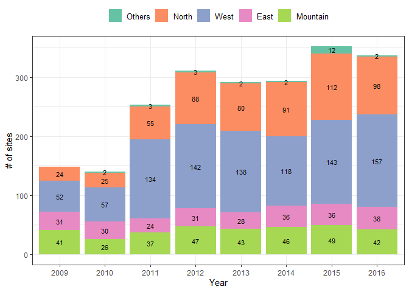
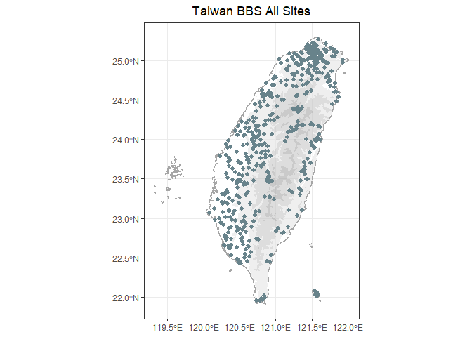

<!-- README.md is generated from README.Rmd. Please edit that file -->

# bbsTaiwan

<!-- badges: start -->

[](https://github.com/SunnyTseng/bbsTaiwan/actions/workflows/R-CMD-check.yaml)
[](https://lifecycle.r-lib.org/articles/stages.html#experimental)

<!-- badges: end -->

The goal of bbsTaiwan is to streamline Taiwan Breeding Birds Survey
(BBS) data retrieval and analysis. It will support data retrieval from
GBIF, where Taiwan BBS data are stored. ‘bbsTrim’ will also include the
population trend modelling. Users can tailor species analysis,
controlling data stratification, preparation, and modeling. The goal is
to expand Taiwan BBS data access to the broader R-society in Taiwan.

### 📑 Overview

### 💻 Installation

You can install and load the development version of bbsTaiwan from
[GitHub](https://github.com/) with:

``` r
# install.packages("devtools")
devtools::install_github("SunnyTseng/bbsTaiwan")

# load the package
library(bbsTaiwan)
```

### ⛺ Main functions

bbsTaiwan provides several intuitive imported datasets and data
processing functions. For accessing the raw Taiwan BBS dataset that is
on GBIF:

- occurrence

- event

- measurementorfacts

- extendedmeasurementorfact

To perform basic data retrieval and visualization:

- bbs_translate

- bbs_fetch

- bbs_plotmap

- bbs_history

- bbs\_

#### If you need raw Taiwan BBS dataset on GBIF:

Taiwan BBS raw data can be accessed directly by typing the object name:

``` r
bbsTaiwan::occurrence
bbsTaiwan::event
bbsTaiwan::measurementorfacts
bbsTaiwan::extendedmeasurementorfact
```

The complete Taiwan BBS dataset on GBIF is following the Darwin Core
Archive (DwC - A) format:

- Occurrence: lists a set of times and locations at which particular
  species have been recorded

- Event: lists includes the protocols used, the sample size, and the
  location for each

- Measurement or Facts: includes additional information relating to the
  events

- Extended Measurement or Fact: includes additional information relating
  to the taxon occurrences

#### `bbsTaiwan` also provide a workflow to process Taiwan BBS data:

This is a basic example which shows you how to use the package:

1.  Check out the distribution of the BBS sites and the number of sites
    that have been surveyed throughout the years:

``` r
bbs_history(type = "plot")
```



``` r
bbs_history(type = "table")
#> # A tibble: 8 × 6
#>   year   East Mountain North  West Others
#>   <chr> <int>    <int> <int> <int>  <int>
#> 1 2009     31       41    24    52      0
#> 2 2010     30       26    25    57      2
#> 3 2011     24       37    55   134      3
#> 4 2012     31       47    88   142      3
#> 5 2013     28       43    80   138      2
#> 6 2014     36       46    91   118      2
#> 7 2015     36       49   112   143     12
#> 8 2016     38       42    98   157      2
```

``` r
bbs_plotmap(NULL)
```



2.  Check all the sites that have been surveyed before

``` r
bbs_sites()
#> # A tibble: 4,160 × 6
#>    site   plot  locationID locality   decimalLatitude decimalLongitude
#>    <chr>  <chr> <chr>      <chr>                <dbl>            <dbl>
#>  1 A02-01 01    A02-01_01  台北縣瑞芳            25.1             122.
#>  2 A02-01 02    A02-01_02  台北縣瑞芳            25.1             122.
#>  3 A02-01 03    A02-01_03  台北縣瑞芳            25.1             122.
#>  4 A02-01 04    A02-01_04  台北縣瑞芳            25.1             122.
#>  5 A02-01 05    A02-01_05  台北縣瑞芳            25.1             122.
#>  6 A02-01 06    A02-01_06  台北縣瑞芳            25.1             122.
#>  7 A02-01 07    A02-01_07  台北縣瑞芳            25.1             122.
#>  8 A02-01 08    A02-01_08  台北縣瑞芳            25.1             122.
#>  9 A02-01 09    A02-01_09  台北縣瑞芳            25.1             122.
#> 10 A02-01 10    A02-01_10  台北縣瑞芳            25.1             122.
#> # ℹ 4,150 more rows
```

2.  Look up the scientific name for species of interest

``` r
bbs_translate(c("白頭翁", "烏頭翁", "台灣噪眉"))
#> [1] "Pycnonotus sinensis"          "Pycnonotus taivanus"         
#> [3] "Trochalopteron morrisonianum"
```

3.  Fetch the data for the species of interest. If you need the dataset
    across all species, leave the argument `target_species` as `NULL`.

``` r
x <- bbs_fetch(target_species = bbs_translate("火冠戴菊鳥"))
#> ! The bird is not in the BBS species list
#> ! 查無鳥名
```

The output from `bbs_fetch` is a list with two elements: `occurrence`
and `site_info`. `occurrence` is a tibble, showing all the observations
for the target species within selected year range

``` r
x
#> NULL
```

The function `bbs_fetch` can also take multiple species at the same
time:

``` r
x <- bbs_fetch(bbs_translate(c("烏頭翁", "白頭翁")))
#> ! The bird is not in the BBS species list
#> ! 查無鳥名
#> ! The bird is not in the BBS species list
#> ! 查無鳥名
```

4.  View the distribution of all the occurrence for the target species
    within selected year range

``` r
bbs_plotmap(bbs_translate(c("烏頭翁", "白頭翁")))
#> ! The bird is not in the BBS species list
#> ! 查無鳥名
#> ! The bird is not in the BBS species list
#> ! 查無鳥名
#> NULL
```
